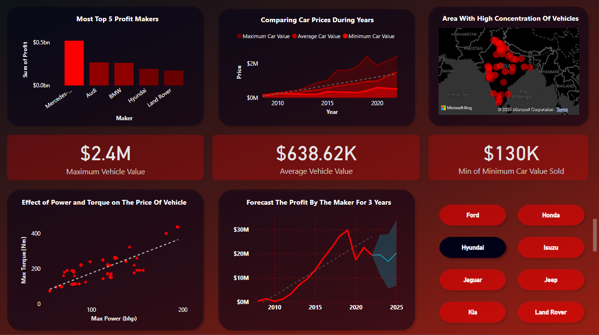
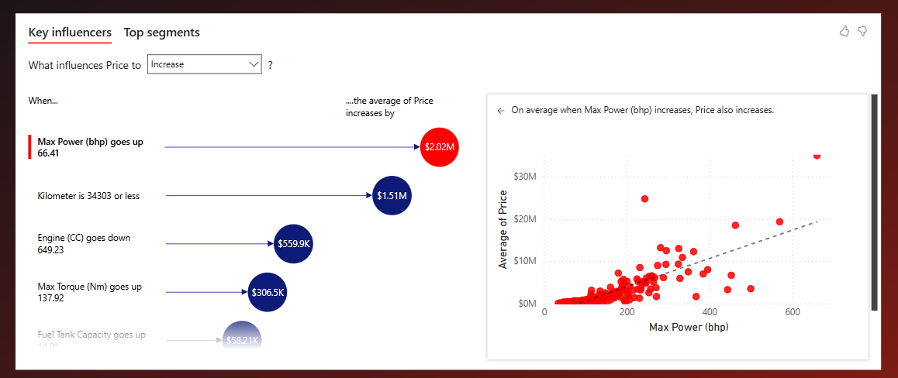
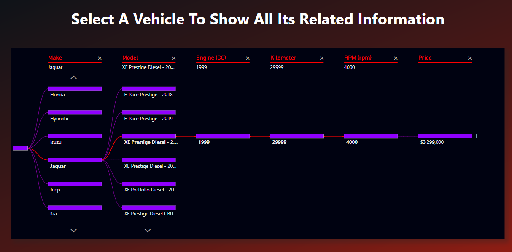

# Data Analysis Project using Power BI


## Screenshots
### 1. Dashboard Overview


### 2. Key Influencers


### 3. Vehicle Information Selection


---

## Overview
This project demonstrates the analysis of vehicle data using Power BI to uncover insights such as top profit makers, factors influencing vehicle prices, and forecast trends. The project includes interactive dashboards and visualizations, enabling users to explore data comprehensively.

---

## Key Insights & Visualizations

### 1. **Top Profit Makers**
- Identifies the top 5 car makers generating the highest profits.
- Visualization: Bar chart displaying profit distribution among makers.

### 2. **Car Price Trends Over Years**
- Tracks changes in vehicle prices (maximum, average, and minimum) from 2010 to 2025.
- Visualization: Line chart highlighting price fluctuations over time.

### 3. **Vehicle Concentration Map**
- Displays regions with the highest concentration of vehicles.
- Visualization: Geospatial heatmap.

### 4. **Summary Metrics**
- **Maximum Vehicle Value:** $2.4M
- **Average Vehicle Value:** $638.62K
- **Minimum Vehicle Value:** $130K

### 5. **Effect of Power and Torque on Price**
- Analyzes the correlation between vehicle power, torque, and pricing.
- Visualization: Scatter plot with a trendline.

### 6. **Profit Forecast**
- Predicts car makers' profits for the next 3 years.
- Visualization: Line chart with forecasted data.

### 7. **Key Influencers**
- Determines factors that impact vehicle pricing the most, such as:
  - Increase in Max Power (bhp) increases price by $2.02M.
  - Decrease in Engine Capacity (CC) impacts pricing by $559.9K.

### 8. **Detailed Vehicle Information**
- Allows selection of a specific vehicle to view its details (e.g., make, model, engine, price, RPM).
- Visualization: Tree diagram with hierarchical filtering.

---

## Tools & Technologies
- **Power BI:** For creating interactive dashboards and data visualizations.
- **Data Sources:** Vehicle datasets containing attributes such as price, engine specifications, mileage, and location.
- **Microsoft Bing Maps:** Integrated for geospatial visualizations.

---

## Features
- **Dynamic Filtering:** Enables users to filter data by vehicle make, model, and year.
- **Interactive Dashboards:** Provides a user-friendly interface for exploring data insights.
- **Predictive Analytics:** Forecasts future trends and profits based on historical data.

---

## Usage
1. Open the Power BI file (`.pbix`) included in the repository.
2. Interact with the dashboards to explore insights.
3. Use filters and slicers to customize the data view.

---

## Key Takeaways
- **Max Power (bhp)** is the most influential factor for price determination.
- **Mercedes-Benz, Audi, and BMW** are the top profit makers in the dataset.
- Predictive modeling suggests increasing profits for leading car makers over the next few years.

---

## Repository Structure
```
root
|
|-- data/             # Raw and processed data files
|-- screenshots/      # Images of Power BI dashboards
|-- project.pbix      # Power BI project file
|-- README.md         # Project documentation
```

## Contributor
- **Mazen Khaled** - Data Analysis and Dashboard Development
